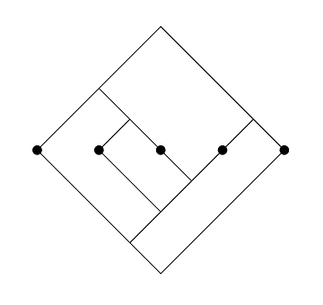

# Thompson's Group *F* and Knot Theory

This repository contains scripts related to
[links](https://en.wikipedia.org/wiki/Link_(knot_theory))
generated by  elements of
[Thompson's group *F*](https://en.wikipedia.org/wiki/Thompson_groups).

## Background

For the purposes of this repository, an element of *F* can be thought
of as a pair of binary trees (rooted, with each node having zero or two
children) with the same number of leaves. These are often drawn with
the second tree inverted so that its leaves lie on the same points
as the first.  For example, the following  represents an element of
*F* with 5 leaves:



Since this diagram is rather unwieldy, it will be simpler to represent
the above diagram as the following "fraction" of bracketings:
`((o(oo))(oo)) / ((o(o(oo)))o)`
The left-hand string represents the top tree; the right-hand, the bottom.
Here, the `o`s represent leaves of the trees, and a pair of parentheses
represents a subtree. To be annoyingly precise, here's a context-free
grammar for the setup:
```
    TREEPAIR ::= TREE "/" TREE
        TREE ::= "o" | "(" TREE TREE ")"
```
We often only consider those tree-pairs which are "reduced",
meaning the top tree cannot have a caret (represented by the exact
string `(oo)`) spanning the same two leaves as a caret of the bottom
tree. See [OEIS](http://oeis.org/A111713). Each element of Thompson's
group *F* has a unique representation as a *reduced* tree-pair.

In his [2018](https://arxiv.org/abs/1810.06034) paper
(and prior in a 2014 paper), the late Vaughan Jones describes a function
from the set of tree-pairs to the set of links: edges of the diagram
become strands of the link, and new strands are added to each face,
connecting a caret of the top tree to a caret of the bottom. Crossings
are formed by an over-strand connecting each internal node's two
children and an under-crossing connecting the node's parent to the newly
added face strand. Below is the output of this mapping on the tree-pair
from before (the result is a two-component unlink):


Jones showed that all links arise from elements of *F*, in analogy with
[Alexander's similar theorem about the braid group](https://en.wikipedia.org/wiki/Alexander%27s_theorem).
It would be desirable to classify which elements of *F* give the same links,
perhaps finding a sufficient set of "moves" in analogy with
[Markov's theorem aboud braids](https://en.wikipedia.org/wiki/Markov_theorem).


## The code here

These are the most important files here:

### [thompson.py](thompson.py)

This file considers strings like `"((o(oo))(oo)) / ((o(o(oo)))o)"`,
constructs a data structure that represents the resulting link,
then computes the signed Gauss code of the link (a format more easily
understandable by SageMath).

### [link_classification.py](link_classification.py)

This file uses `thompson.py` and interfaces with SageMath to classify
*all* reduced tree-pairs by the HOMFLYPT polynomial of the link they
produce. To use it, type somthing like this into a working SageMath
REPL:
```python
import sys
sys.path.insert(0, "[PATH_OF_THIS_REPO_GOES_HERE]")
from link_classification import main, words_to_link
from time import time

t0 = time()
mapping = main(6)
t1 = time()

with open("unoriented6.txt", "w") as f:    
    for key, arr in mapping.items():
        L = words_to_link(*arr[0])
        az = L.homfly_polynomial('a', 'z', 'az')
        print("Description:", file=f)
        print(f"Components: {key[0]}", file=f)
        print(f"Homfly (lm): {key[1]}", file=f)
        print(f"Homfly (az): {az}", file=f)
        for pair in arr:
            print('\t' + ' / '.join(pair), file=f)
        print(file=f)
    print(f"elapsed time: {t1 - t0}", file=f)
```
The output of this is a file like
[unoriented_data/unoriented5.txt](unoriented_data/unoriented5.txt).
Note that unoriented9.txt took 5 hours to compute on my laptop, with
most of that time being dominated by the computations of HOMFLYPT
polynomials.

### [moves.py](moves.py) and [moves_to_components.py](moves_to_components.py)

This is an attempt at implementing several known link-preserving "moves"
on tree-pairs to see how far they get towards being "all of the moves we
need". Tests are included in [test_moves.py](test_moves.py) and can be
run with [PyTest](https://docs.pytest.org/en/6.2.x/getting-started.html).

